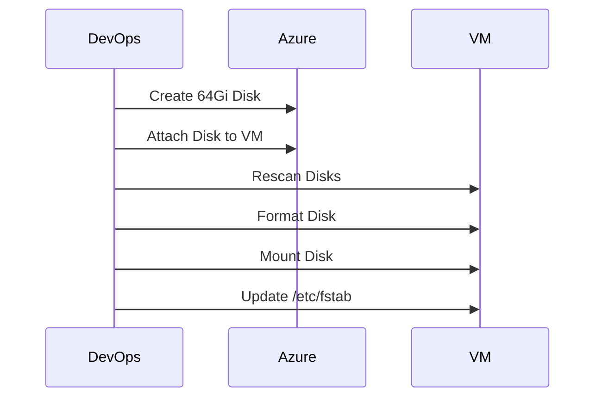

# 🚀 Azure VM Disk Expansion & Data Disk Mount (Production Guide)


---

## 📌 Project Overview

This project demonstrates how to:

* Expand an Azure VM OS disk from 32Gi → 64Gi
* Create and attach a new 64Gi Standard HDD disk
* Mount the disk at `/mnt/xfusion-disk`
* Configure persistent mounting via `/etc/fstab`

This reflects real-world DevOps cloud storage operations.

---

# 🏗️ Architecture Diagram

```mermaid
flowchart TD
    A[Azure Portal / CLI] --> B[xfusion-vm]
    B --> C[OS Disk - 64Gi]
    B --> D[Data Disk - 64Gi]
    D --> E[/mnt/xfusion-disk]
```

---

# 🔁 Workflow Diagram



---

# 🚀 Implementation Steps

---

## 1️⃣ Resize OS Disk

### Using Azure CLI

```bash
az disk update \
  --resource-group kml_rg_main-2169e452295d4440 \
  --name <OS_DISK_NAME> \
  --size-gb 64
```

Inside VM:

```bash
sudo growpart /dev/sdb 1
sudo resize2fs /dev/sdb1
df -h
```

---

## 2️⃣ Create & Attach Data Disk

```bash
az disk create \
  --resource-group kml_rg_main-2169e452295d4440 \
  --name xfusion-disk \
  --size-gb 64 \
  --sku Standard_LRS
```

Attach:

```bash
az vm disk attach \
  --resource-group kml_rg_main-2169e452295d4440 \
  --vm-name xfusion-vm \
  --name xfusion-disk
```

---

## 3️⃣ Configure Disk Inside VM

Rescan:

```bash
sudo partprobe
lsblk
```

Identify unused 64Gi disk.

---

### Format Disk

```bash
sudo mkfs.ext4 /dev/sdX
```

---

### Create Mount Directory

```bash
sudo mkdir -p /mnt/xfusion-disk
```

---

### Mount Disk

```bash
sudo mount /dev/sdX /mnt/xfusion-disk
df -h
```

---

# 💾 Persistent Mount Configuration

Get UUID:

```bash
sudo blkid /dev/sdX
```

Edit fstab:

```bash
sudo vi /etc/fstab
```

Add:

```
UUID=<your-uuid>   /mnt/xfusion-disk   ext4   defaults,nofail   0   2
```

Test:

```bash
sudo mount -a
```

---

# 🔐 Best Practices Applied

* Verified disk before formatting
* Used UUID instead of device name
* Tested mount before reboot
* Avoided formatting OS disk
* Followed cloud-first provisioning model

---

# 🧠 DevOps Skills Demonstrated

* Azure Infrastructure Management
* Linux Disk & Filesystem Management
* Cloud Storage Provisioning
* Troubleshooting Disk Detection
* Production-Level Mount Persistence

---

# 📊 Before & After Snapshot

| Component   | Before | After             |
| ----------- | ------ | ----------------- |
| OS Disk     | 32Gi   | 64Gi              |
| Data Disk   | None   | 64Gi              |
| Mount Point | N/A    | /mnt/xfusion-disk |

---

# 👤 Author

**Yann Assiri**
DevOps / Cloud Engineer
GitHub: [https://github.com/YOUR_USERNAME](https://github.com/YOUR_USERNAME)

---

# ⭐ Why This Project Matters

This simulates real-world cloud operations tasks performed by DevOps engineers:

* Infrastructure scaling
* Production storage expansion
* Zero-downtime configuration
* Persistent configuration management

---

# 📂 Suggested Supporting Scripts

Inside `scripts/`:

### create-disk.sh

```bash
#!/bin/bash
az disk create \
  --resource-group kml_rg_main-2169e452295d4440 \
  --name xfusion-disk \
  --size-gb 64 \
  --sku Standard_LRS
```

---

### attach-disk.sh

```bash
#!/bin/bash
az vm disk attach \
  --resource-group kml_rg_main-2169e452295d4440 \
  --vm-name xfusion-vm \
  --name xfusion-disk
```

---

### mount-disk.sh

```bash
#!/bin/bash
sudo partprobe
lsblk
echo "Identify correct disk before formatting."
```

---
